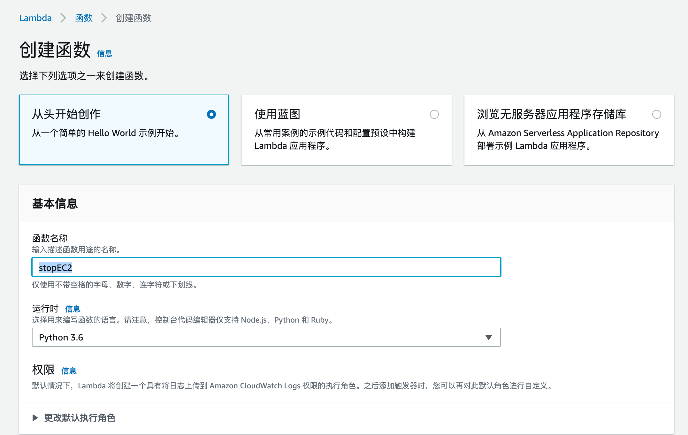
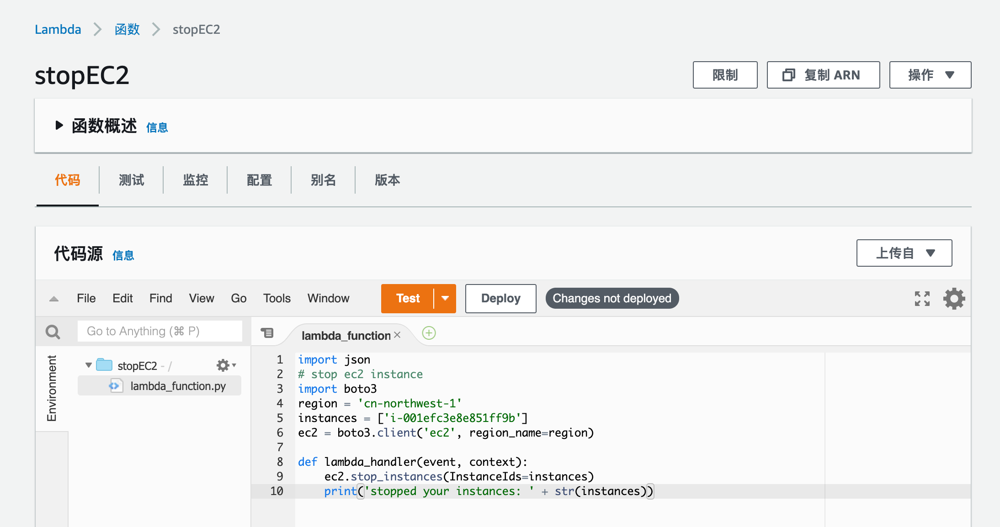
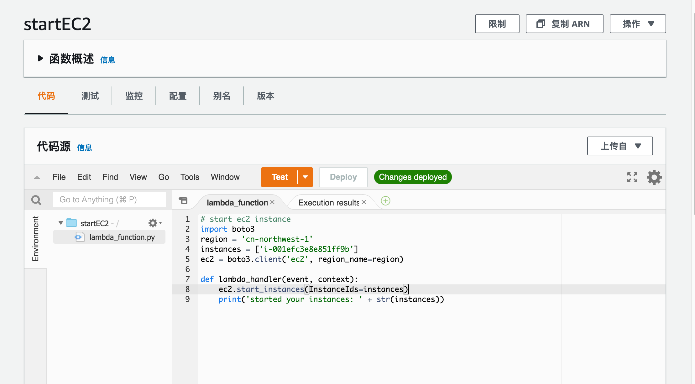
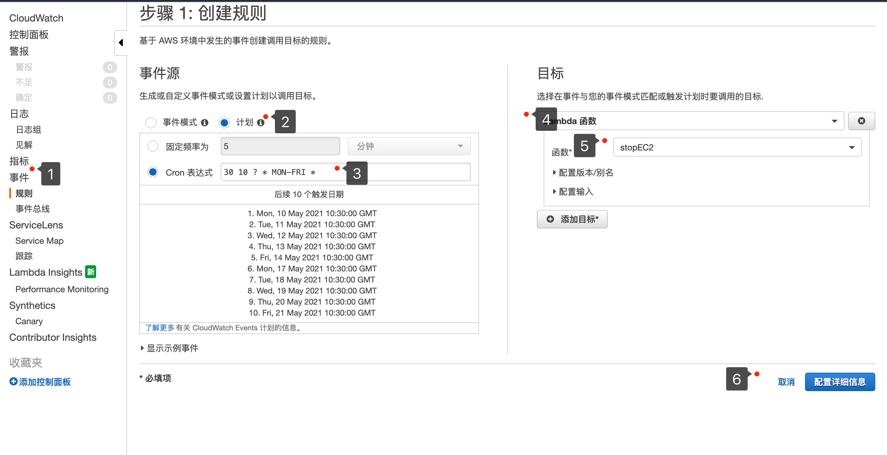

# aws ec2 定时开关机
使用lambda 函数 cloudwatch 事件Cron表达式实现EC2定时开关机
## 1. 创建lambda 角色
登录IAM控制台选择创建角色**lambda-ec2-role**，选择lambda

创建策略**lambda-ec2-policy**附加以下权限策略。

```json
{
    "Version": "2012-10-17",
    "Statement": [
        {
            "Sid": "VisualEditor0",
            "Effect": "Allow",
            "Action": [
                "logs:CreateLogStream",
                "ec2:Start*",
                "logs:CreateLogGroup",
                "logs:PutLogEvents",
                "ec2:Stop*"
            ],
            "Resource": "*"
        }
    ]
}
```
## 2. 创建lambda 函数

登录控制台创建lambda函数 https://cn-northwest-1.console.amazonaws.cn/lambda/home?region=cn-northwest-1#/create/function



**从头开始创作**

函数名称：stopEC2

运行时：Python3.6

更改默认执行角色：使用现有的角色选择**lmbda-ec2-role**

创建函数，写入以下代码（停止ec2 instance）


```python
# stop ec2 instance
import boto3
region = 'cn-northwest-1'
instances = ['i-001efc3e8e851ff9b']
ec2 = boto3.client('ec2', region_name=region)

def lambda_handler(event, context):
    ec2.stop_instances(InstanceIds=instances)
    print('stopped your instances: ' + str(instances))
```



在创建一个lambda函数startEC2启动ec2 instance

启动ec2 instance 

```python
# start ec2 instance
import boto3
region = 'cn-northwest-1'
instances = ['i-001efc3e8e851ff9b']
ec2 = boto3.client('ec2', region_name=region)

def lambda_handler(event, context):
    ec2.start_instances(InstanceIds=instances)
    print('started your instances: ' + str(instances))
```



## 3. 创建cloudwatch events 规则

登录cloudwatch控制台选择事件创建规则

cron表达式： UTC时间每周一至周五10:30（即北京时间18:30）执行stopEC2 lambda 函数



Cron 表达式参考

## Cron 表达式

Cron 表达式有六个必填字段，之间以空格分隔。

**语法**

```
cron(fields)
```

| **字段** | **值**          | **通配符**    |
| :------- | :-------------- | :------------ |
| 分钟     | 0-59            | , - * /       |
| 小时     | 0-23            | , - * /       |
| 日期     | 1-31            | , - * ? / L W |
| 月       | 1-12 或 JAN-DEC | , - * /       |
| 星期几   | 1-7 或 SUN-SAT  | , - * ? L     |
| 年       | 1970-2199       | , - * /       |

**Wildcards**

- **,**（逗号）通配符包含其他值。在“月份”字段中，JAN、FEB 和 MAR 将包含 January、February 和 March。

- **-**（破折号）通配符用于指定范围。在“日”字段中，1-15 将包含指定月份的 1 - 15 日。

- *****（星号）通配符包含该字段中的所有值。在“小时”字段中，***** 将包含每个小时。您不能在“日期”和“星期几”字段中同时使用 ***** 。如果您在一个中使用它，则必须在另一个中使用 **?** 。

- **/**（正斜杠）通配符用于指定增量。在“分钟”字段中，您可以输入 1/10 以指定从一个小时的第一分钟开始的每个第十分钟 (例如，第 11 分钟、第 21 分钟和第 31 分钟，依此类推)。

- **?**（问号）通配符用于指定一个或另一个。在“日期”字段中，您可以输入 **7**，如果您不介意 7 日是星期几，则可以在“星期几”字段中输入 **?**

- “日期”或“星期几”字段中的 **L** 通配符用于指定月或周的最后一天。

- “日期”字段中的 `W` 通配符用于指定工作日。在“日期”字段中，`3W` 用于指定最靠近当月的第三周的日。

- “星期几”字段中的 **#** 通配符用于指定一个月内所指定星期几的特定实例。例如，3#2 指该月的第二个星期二：3 指的是星期二，因为它是每周的第三天，2 是指该月内该类型的第二天。

  **注意**

  如果使用 “#” 字符，则只能在星期字段中定义一个表达式。例如，`"3#1,6#3"`是无效的，因为它被解释为两个表达式。

**Restrictions**

- 您无法在同一 Cron 表达式中为日期和星期几字段同时指定值。如果您在其中一个字段中指定了值（或一个 *），则必须在另一个字段中使用 **?**（问号）。
- 不支持产生的速率快于 1 分钟的 Cron 表达式。

**Examples**

在创建带计划的规则时，可以使用以下示例 cron 字符串。

| 分钟 | 小时 | 日期 | 月   | 星期几  | 年份 | 意义                                                         |
| :--- | :--- | :--- | :--- | :------ | :--- | :----------------------------------------------------------- |
| 0    | 10   | *    | *    | ?       | *    | 每天上午的 10:00 (UTC) 运行                                  |
| 15   | 12   | *    | *    | ?       | *    | 每天在下午 12:15 (UTC) 运行                                  |
| 0    | 18   | ?    | *    | MON-FRI | *    | 每星期一到星期五的下午 6:00 (UTC) 运行                       |
| 0    | 8    | 1    | *    | ?       | *    | 每月第 1 天的上午 8:00 (UTC) 运行                            |
| 0/15 | *    | *    | *    | ?       | *    | 每 15 分钟运行一次                                           |
| 0/10 | *    | ?    | *    | MON-FRI | *    | 从星期一到星期五，每 10 分钟运行一次                         |
| 0/5  | 8-17 | ?    | *    | MON-FRI | *    | 每星期一到星期五的上午 8:00 和下午 5:55 (UTC) 之间，每 5 分钟运行一次 |

https://docs.amazonaws.cn/AmazonCloudWatch/latest/events/ScheduledEvents.html

