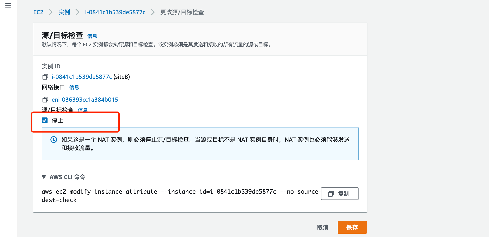

# net to net vpn with strongswan on EC2

使用srongswan 在ec2上配置ipsecvpn 实现两个vpc网络互通。

## 环境


**siteA**

```bash
vpc: 172.31.0.0/16
Ec2: Ubuntu 20.04.1 LTS  
私网地址：172.31.44.127/20  
EIP: 52.83.55.210
hostname: vpn-A
```

**siteB**

```bash
vpc: 172.22.0.0/16
EC2:Ubuntu 18.04.5
私网地址：172.22.0.168/24
EIP: 69.231.172.170
hostname: vpn-B
```

两台ec2 主机分别部署在不同vpc，部署在公有子网，并关闭**源/目标检查**




## 1. 安装strongswan

```bash
apt install strongswan -y
```

## 2. 配置ipv4 转发

```bash
# 编辑/etc/sysctl.conf 添加
net.ipv4.ip_forward=1
# 执行sysctl -p 使配置生效
```

## 3. SiteA 配置

1. 配置/etc/ipsec.conf 文件

   ```bash
   root@vpn-A:~# cat ipsec.conf.bak
   # ipsec.conf - strongSwan IPsec configuration file
   
   # basic configuration
   
   config setup
           uniqueids=yes
   	# strictcrlpolicy=yes
   	# uniqueids = no
   
   # Add connections here.
   
   # Sample VPN connections
   
   #conn sample-self-signed
   #      leftsubnet=10.1.0.0/16
   #      leftcert=selfCert.der
   #      leftsendcert=never
   #      right=192.168.0.2
   #      rightsubnet=10.2.0.0/16
   #      rightcert=peerCert.der
   #      auto=start
   
   #conn sample-with-ca-cert
   #      leftsubnet=10.1.0.0/16
   #      leftcert=myCert.pem
   #      right=192.168.0.2
   #      rightsubnet=10.2.0.0/16
   #      rightid="C=CH, O=Linux strongSwan CN=peer name"
   #      auto=start
   #
   
   
   conn Tunnel1
   	auto=start
   	left=%defaultroute
   	leftid=52.83.55.210 # 本端EIP
   	right=69.231.172.170 # 对端vgw地址
   	type=tunnel
   	leftauth=psk
   	rightauth=psk
   	keyexchange=ikev1
   	ike=aes128-sha1-modp1024
   	ikelifetime=8h
   	esp=aes128-sha1-modp1024
   	lifetime=1h
   	keyingtries=%forever
   	leftsubnet=172.31.0.0/16 # 本端私网地址
   	rightsubnet=172.22.0.0/16 # 对端私网地址
   	dpddelay=10s
   	dpdtimeout=30s
   	dpdaction=restart
   	## Please note the following line assumes you only have two tunnels in your Strongswan configuration file. This "mark" value must be unique and may need to be changed based on other entries in your configuration file.
   	mark=100
   	## Uncomment the following line to utilize the script from the "Automated Tunnel Healhcheck and Failover" section. Ensure that the integer after "-m" matches the "mark" value above, and <VPC CIDR> is replaced with the CIDR of your VPC
   	## (e.g. 192.168.1.0/24)
   	#leftupdown="/etc/ipsec.d/aws-updown.sh -ln Tunnel1 -ll 169.254.149.94/30 -lr 169.254.149.93/30 -m 100 -r <VPC CIDR>"
   ```

2. 配置psk 编辑/etc/ipsec.secrets 

   ```bash
   root@vpn-A:~# cat /etc/ipsec.secrets
   # This file holds shared secrets or RSA private keys for authentication.
   
   # RSA private key for this host, authenticating it to any other host
   # which knows the public part.
   52.83.55.210 69.231.172.170 : PSK "ethanvpn"
   ```

   

3. 编辑/etc/strongswan.d/charon.conf 修改

   ```bash
   install_routes = no # 取消注释，yes改为no
   ```

4. 配置tunnel interface 和路由

   ```bash
   sudo ip link add Tunnel1 type vti local 172.31.44.127 remote 69.231.172.170 key 100
   sudo ip link set Tunnel1 up mtu 1419
   sudo ip route add 172.22.0.0/16 dev Tunnel1 metric 100
   ```

## 4. siteB配置

1. 配置/etc/ipsec.conf 文件

   ```bash
   root@vpn-B:~# cat ipsec.conf.bak
   # ipsec.conf - strongSwan IPsec configuration file
   
   # basic configuration
   
   config setup
           uniqueids=yes
   	# strictcrlpolicy=yes
   	# uniqueids = no
   
   # Add connections here.
   
   # Sample VPN connections
   
   #conn sample-self-signed
   #      leftsubnet=10.1.0.0/16
   #      leftcert=selfCert.der
   #      leftsendcert=never
   #      right=192.168.0.2
   #      rightsubnet=10.2.0.0/16
   #      rightcert=peerCert.der
   #      auto=start
   
   #conn sample-with-ca-cert
   #      leftsubnet=10.1.0.0/16
   #      leftcert=myCert.pem
   #      right=192.168.0.2
   #      rightsubnet=10.2.0.0/16
   #      rightid="C=CH, O=Linux strongSwan CN=peer name"
   #      auto=start
   
   conn Tunnel1
   	auto=start
   	left=%defaultroute
   	leftid=69.231.172.170 # 本端EIP
   	right=52.83.55.210 # 对端vgw地址
   	type=tunnel
   	leftauth=psk
   	rightauth=psk
   	keyexchange=ikev1
   	ike=aes128-sha1-modp1024
   	ikelifetime=8h
   	esp=aes128-sha1-modp1024
   	lifetime=1h
   	keyingtries=%forever
   	leftsubnet=172.22.0.0/16 # 本端私网地址
   	rightsubnet=172.31.0.0/16 # 对端私网地址
   	dpddelay=10s
   	dpdtimeout=30s
   	dpdaction=restart
   	## Please note the following line assumes you only have two tunnels in your Strongswan configuration file. This "mark" value must be unique and may need to be changed based on other entries in your configuration file.
   	mark=100
   	## Uncomment the following line to utilize the script from the "Automated Tunnel Healhcheck and Failover" section. Ensure that the integer after "-m" matches the "mark" value above, and <VPC CIDR> is replaced with the CIDR of your VPC
   	## (e.g. 192.168.1.0/24)
   	#leftupdown="/etc/ipsec.d/aws-updown.sh -ln Tunnel1 -ll 169.254.149.94/30 -lr 169.254.149.93/30 -m 100 -r <VPC CIDR>"
   ```

2. 配置psk 编辑/etc/ipsec.secrets 

   ```bash
   root@vpn-B:~# cat /etc/ipsec.secrets
   # This file holds shared secrets or RSA private keys for authentication.
   
   # RSA private key for this host, authenticating it to any other host
   # which knows the public part.
   69.231.172.170 52.83.55.210 : PSK "ethanvpn"
   ```

   

3. 编辑/etc/strongswan.d/charon.conf 修改

   ```bash
   install_routes = no # 取消注释，yes改为no
   ```

   

4. 配置tunnel interface 和路由

   ```bash
   sudo ip link add Tunnel1 type vti local 172.22.0.168 remote 52.83.55.210 key 100
   sudo ip link set Tunnel1 up mtu 1419
   sudo ip route add 172.31.0.0/16 dev Tunnel1 metric 100
   ```

   

## 5. 配置路由表

配置site A侧vpc路由表下一跳指向vpn-a的instance 


配置site B侧vpc路由表下一跳指向vpn-b的instance 


## 6. 测试

Vpn-a 侧的一台主机172.31.14.148

Vpn-b 侧的一套主机172.22.0.222


```bash
root@vpn-A:~# ipsec status
Security Associations (1 up, 0 connecting):
     Tunnel1[1]: ESTABLISHED 6 seconds ago, 172.31.44.127[52.83.55.210]...69.231.172.170[69.231.172.170]
     Tunnel1{1}:  INSTALLED, TUNNEL, reqid 1, ESP in UDP SPIs: c47a6000_i c234b9a2_o
     Tunnel1{1}:   172.31.0.0/16 === 172.22.0.0/16
root@vpn-A:~# ip a
1: lo: <LOOPBACK,UP,LOWER_UP> mtu 65536 qdisc noqueue state UNKNOWN group default qlen 1000
    link/loopback 00:00:00:00:00:00 brd 00:00:00:00:00:00
    inet 127.0.0.1/8 scope host lo
       valid_lft forever preferred_lft forever
    inet6 ::1/128 scope host
       valid_lft forever preferred_lft forever
2: eth0: <BROADCAST,MULTICAST,UP,LOWER_UP> mtu 9001 qdisc fq_codel state UP group default qlen 1000
    link/ether 0a:74:a6:12:4c:64 brd ff:ff:ff:ff:ff:ff
    inet 172.31.44.127/20 brd 172.31.47.255 scope global dynamic eth0
       valid_lft 2172sec preferred_lft 2172sec
    inet6 fe80::874:a6ff:fe12:4c64/64 scope link
       valid_lft forever preferred_lft forever
3: ip_vti0@NONE: <NOARP> mtu 1480 qdisc noop state DOWN group default qlen 1000
    link/ipip 0.0.0.0 brd 0.0.0.0
4: Tunnel1@NONE: <POINTOPOINT,NOARP,UP,LOWER_UP> mtu 1419 qdisc noqueue state UNKNOWN group default qlen 1000
    link/ipip 172.31.44.127 peer 69.231.172.170
    inet6 fe80::5efe:ac1f:2c7f/64 scope link
       valid_lft forever preferred_lft forever
```