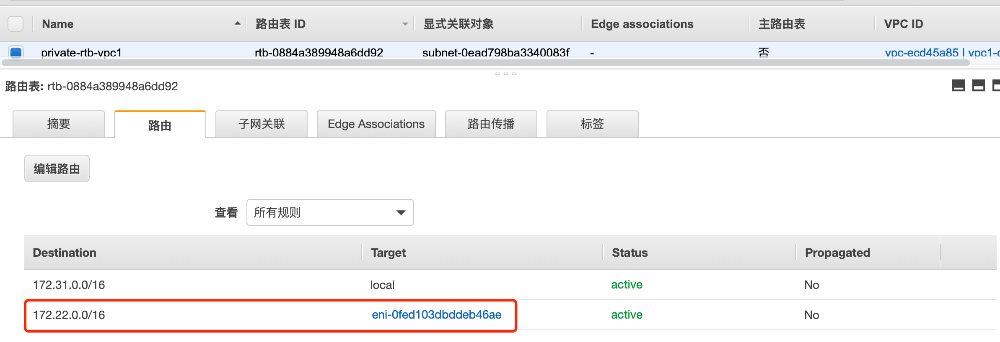

# strongswan IPSec vpn net-net

## 环境：

### vpc1

```bash
vpc1： 172.31.0.0/16
swan1：172.31.0.179/24, Ubuntu 18.04.5 LTS, 
public-subnet-01:172.31.0.0/24
private-subnet-01:172.31.1.0/24
```

vpc1 公共路由表


公共路由表关联的子网

vpc1 私有路由表

vpc1 私有路由表关联的子网


### vpc2

```bash
vpc1： 172.22.0.0/16
swan2：172.22.0.20/24, Ubuntu 18.04.5 LTS, 
public-subnet-01:172.22.0.0/24
private-subnet-01:172.22.1.0/24, 172.22.11.0/24
```


vpc2 公共路由表


vpc2 公共路由表关联的子网

vpc2 私有路由表

vpc 私有路由表 关联的子网


## 安装strongswan

在swan1，swan2 上安装strongswan

```bash
apt install strongswan -y
```

## 配置ipv4 转发

```bash
# 编辑/etc/sysctl.conf 添加
net.ipv4.ip_forward=1
# 执行sysctl -p 使配置生效
```

## swan1 配置

vim /etc/ipsec.conf

```bash
root@swan1:~# cat /etc/ipsec.conf
# ipsec.conf - strongSwan IPsec configuration file
# basic configuration
config setup
	# strictcrlpolicy=yes
	# uniqueids = no
# Add connections here.
# Sample VPN connections
conn Tunnel1
	auto=start
	left=%defaultroute
	leftid=69.231.179.211 # 本端EIP
	right=52.83.155.25 # 对端vgw地址
	type=tunnel
	leftauth=psk
	rightauth=psk
	keyexchange=ikev2
	ike=aes256-sha256-modp1024
	ikelifetime=8h
	esp=aes256-sha256-modp1024
	lifetime=1h
	keyingtries=%forever
	leftsubnet=172.31.0.0/16 # 本端私网地址
	rightsubnet=172.22.0.0/24,172.22.1.0/24 # 对端私网地址
	dpddelay=10s
	dpdtimeout=30s
	dpdaction=restart

#conn sample-self-signed
#      leftsubnet=10.1.0.0/16
#      leftcert=selfCert.der
#      leftsendcert=never
#      right=192.168.0.2
#      rightsubnet=10.2.0.0/16
#      rightcert=peerCert.der
#      auto=start

#conn sample-with-ca-cert
#      leftsubnet=10.1.0.0/16
#      leftcert=myCert.pem
#      right=192.168.0.2
#      rightsubnet=10.2.0.0/16
#      rightid="C=CH, O=Linux strongSwan CN=peer name"
#      auto=start
```

> 可以用id标识
>
> leftid=swan1
>
> rightid=swan2
>
> right=x.x.x.x


vim /etc/ipsec.secrets

```bash
root@swan1:~# cat /etc/ipsec.secrets
# This file holds shared secrets or RSA private keys for authentication.

# RSA private key for this host, authenticating it to any other host
# which knows the public part.

69.231.179.211 : PSK 12345
52.83.155.25 : PSK 12345
```

更改源/目标检查


## swan2 配置

```bash
root@swan2:~# cat /etc/ipsec.conf
# ipsec.conf - strongSwan IPsec configuration file

# basic configuration

config setup
	# strictcrlpolicy=yes
	# uniqueids = no

# Add connections here.
# Sample VPN connections
#

conn Tunnel1
	auto=start
	left=%defaultroute
	leftid=52.83.155.25 # 本端EIP
	right=69.231.179.211 # 对端vgw地址
	type=tunnel
	leftauth=psk
	rightauth=psk
	keyexchange=ikev2
	ike=aes256-sha256-modp1024
	ikelifetime=8h
	esp=aes256-sha256-modp1024
	lifetime=1h
	keyingtries=%forever
	leftsubnet=172.22.0.0/24,172.22.1.0/24,172.22.11.0/24 # 本端私网地址, ikev2 可以指定多个网段，v1不行
	rightsubnet=172.31.0.0/16 # 对端私网地址
	dpddelay=10s
	dpdtimeout=30s
	dpdaction=restart


#conn sample-self-signed
#      leftsubnet=10.1.0.0/16
#      leftcert=selfCert.der
#      leftsendcert=never
#      right=192.168.0.2
#      rightsubnet=10.2.0.0/16
#      rightcert=peerCert.der
#      auto=start

#conn sample-with-ca-cert
#      leftsubnet=10.1.0.0/16
#      leftcert=myCert.pem
#      right=192.168.0.2
#      rightsubnet=10.2.0.0/16
#      rightid="C=CH, O=Linux strongSwan CN=peer name"
#      auto=start
```

vim /etc/ipsec.secrets

```bash
root@swan2:~# cat /etc/ipsec.secrets
# This file holds shared secrets or RSA private keys for authentication.

# RSA private key for this host, authenticating it to any other host
# which knows the public part.
52.83.155.25 : PSK 12345
69.231.179.211 : PSK 12345
```
更改源/目标检查


## 重启strongswan

swan1 swan2 重启动strongswan

```bash
systemctl restart strongswan
root@swan2:~# ipsec status
Security Associations (1 up, 0 connecting):
     Tunnel1[3]: ESTABLISHED 25 minutes ago, 172.22.0.20[52.83.155.25]...69.231.179.211[69.231.179.211]
     Tunnel1{3}:  INSTALLED, TUNNEL, reqid 3, ESP in UDP SPIs: c7090bb3_i c118bcd7_o
     Tunnel1{3}:   172.22.0.0/24 172.22.1.0/24 === 172.31.0.0/16
     
root@swan1:~# ipsec ip xfrm state
/usr/sbin/ipsec: unknown command `ip' (`ipsec --help' for list)
root@swan1:~# ip xfrm state
src 172.31.0.179 dst 52.83.155.25
	proto esp spi 0xc7090bb3 reqid 1 mode tunnel
	replay-window 0 flag af-unspec
	auth-trunc hmac(sha256) 0x90a9c6f61a68cddb718fb8740bb190ef98a164d6523f29228f8d92aa5b76806b 128
	enc cbc(aes) 0xe511ccfc15a067ce3d4418dd0f4b39266a4d91fc23681057b48f067cb76a3244
	encap type espinudp sport 4500 dport 4500 addr 0.0.0.0
	anti-replay context: seq 0x0, oseq 0x6, bitmap 0x00000000
src 52.83.155.25 dst 172.31.0.179
	proto esp spi 0xc118bcd7 reqid 1 mode tunnel
	replay-window 32 flag af-unspec
	auth-trunc hmac(sha256) 0xb8d6c7e7c1851d6e689b482f0e4f40de70276b53ecaade92287c907fae395a68 128
	enc cbc(aes) 0xc56e183fb76aab4de8b1bb2295d4bc3f2848afa08418fa276078881c357cecea
	encap type espinudp sport 4500 dport 4500 addr 0.0.0.0
	anti-replay context: seq 0x6, oseq 0x0, bitmap 0x0000003f
root@swan1:~# ip xfrm policy
src 172.31.0.0/16 dst 172.22.1.0/24
	dir out priority 379519
	tmpl src 172.31.0.179 dst 52.83.155.25
		proto esp spi 0xc7090bb3 reqid 1 mode tunnel
src 172.22.1.0/24 dst 172.31.0.0/16
	dir fwd priority 379519
	tmpl src 52.83.155.25 dst 172.31.0.179
		proto esp reqid 1 mode tunnel
src 172.22.1.0/24 dst 172.31.0.0/16
	dir in priority 379519
	tmpl src 52.83.155.25 dst 172.31.0.179
		proto esp reqid 1 mode tunnel
src 172.31.0.0/16 dst 172.22.0.0/24
	dir out priority 379519
	tmpl src 172.31.0.179 dst 52.83.155.25
		proto esp spi 0xc7090bb3 reqid 1 mode tunnel
src 172.22.0.0/24 dst 172.31.0.0/16
	dir fwd priority 379519
	tmpl src 52.83.155.25 dst 172.31.0.179
		proto esp reqid 1 mode tunnel
src 172.22.0.0/24 dst 172.31.0.0/16
	dir in priority 379519
	tmpl src 52.83.155.25 dst 172.31.0.179
		proto esp reqid 1 mode tunnel
src 0.0.0.0/0 dst 0.0.0.0/0
	socket in priority 0
src 0.0.0.0/0 dst 0.0.0.0/0
	socket out priority 0
src 0.0.0.0/0 dst 0.0.0.0/0
	socket in priority 0
src 0.0.0.0/0 dst 0.0.0.0/0
	socket out priority 0
src ::/0 dst ::/0
	socket in priority 0
src ::/0 dst ::/0
	socket out priority 0
src ::/0 dst ::/0
	socket in priority 0
src ::/0 dst ::/0
	socket out priority 0
```

配置路由表

vpc1 私有路由表



Vpc2 私有路由表


测试


## 配置nat

配置nat 可以使用swan2 即可以是vpn网关，也可以是nat网关，是私网ec2 访问internet， 不在需要单独建立nat实例

```bash
iptables -t nat -A POSTROUTING -s 172.22.0.0/16 -j MASQUERADE
```

配置路由表


测试  ping www.baidu.com


## 配置2

swan1

```bash
conn %default
        ikelifetime=1440m
        keylife=60m
        rekeymargin=3m
        keyingtries=1
        keyexchange=ikev1
        authby=secret

conn Tunnel1
        left=%defaultroute
        leftsubnet=172.31.0.0/16
        leftid=swan1
        leftfirewall=yes
        right=52.83.155.25
        rightsubnet=172.22.0.0/16
        rightid=swan2
        auto=add
        ike=aes128-sha1-modp1536
        esp=aes128-sha1
        keyexchange=ikev2
```


swan2

```bash
conn %default
        ikelifetime=1440m
        keylife=60m
        rekeymargin=3m
        keyingtries=1
        keyexchange=ikev1
        authby=secret

conn Tunnel1
        left=%defaultroute
        leftsubnet=172.22.0.0/16
        leftid=swan2
        leftfirewall=yes
        right=69.231.179.211
        rightsubnet=172.31.0.0/16
        rightid=swan1
        auto=start
        ike=aes128-sha1-modp1536
        esp=aes128-sha1
        keyexchange=ikev2
```


