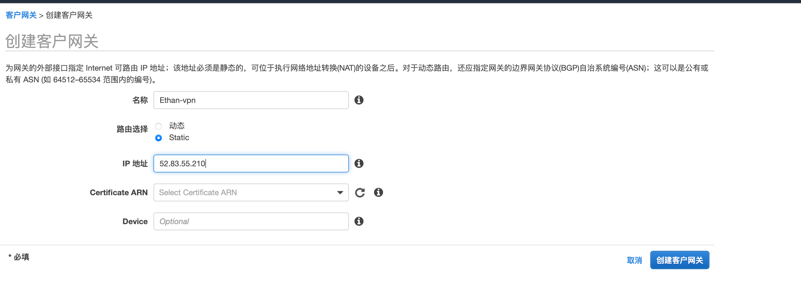
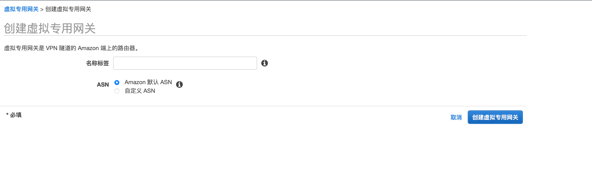
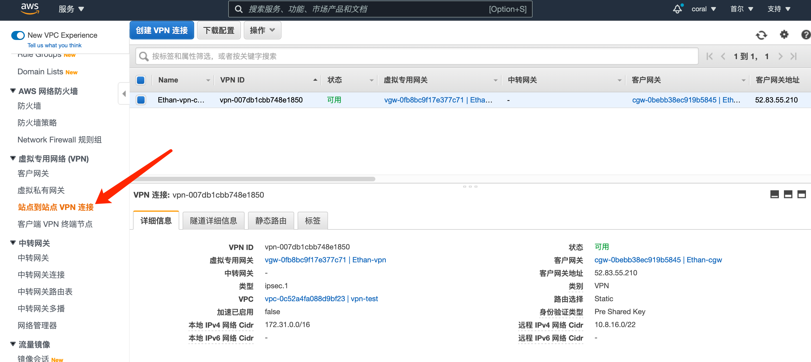
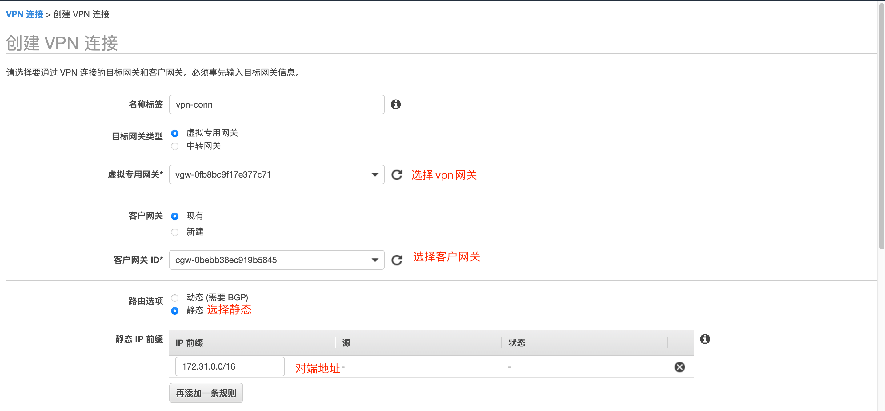
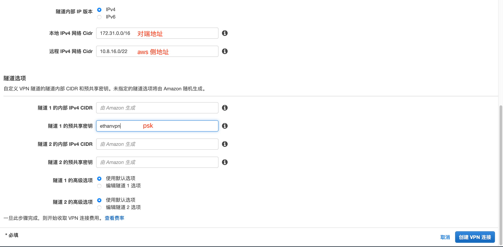
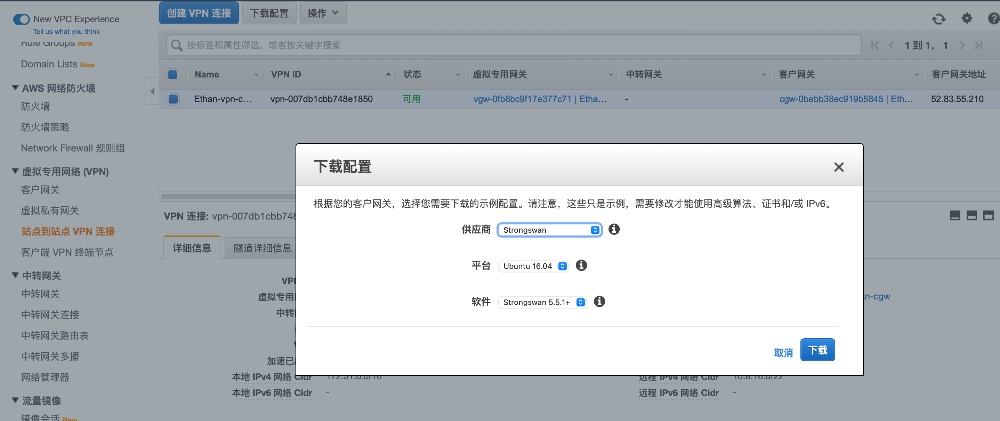
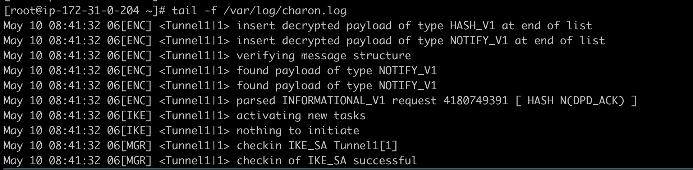
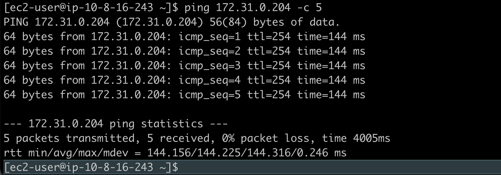
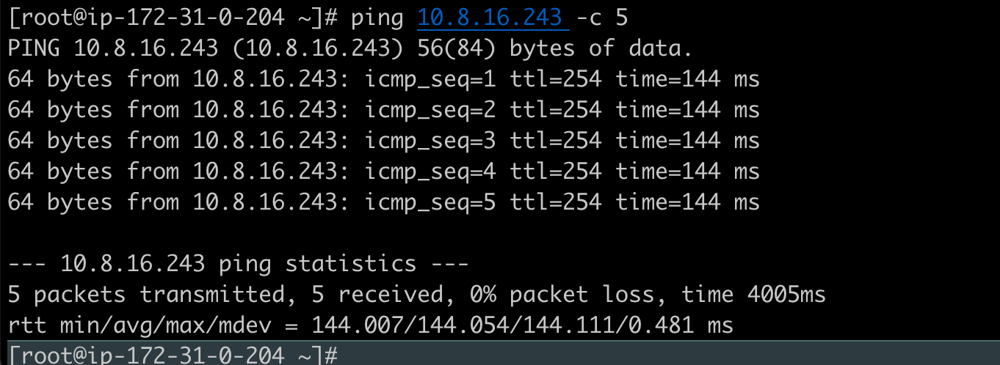

# strongswan 对接aws vpn

## 环境

本次测试环境使用aws 宁夏的一个vpc网络：172.31.0.0/16 子网地址：172.31.0.0/20 

对端是aws 首尔vpc 10.8.16.0/22 

EC2系统版本

```bash
[root@ip-172-31-0-204 ~]# cat /etc/image-id
image_name="amzn2-ami-hvm"
image_version="2"
image_arch="x86_64"
image_file="amzn2-ami-hvm-2.0.20210427.0-x86_64.xfs.gpt"
image_stamp="0ddc-a4d4"
image_date="20210429161802"
recipe_name="amzn2 ami"
recipe_id="3dbb01f4-c991-6a7d-6833-f41e-811d-5043-9ec16fe4"


[root@ip-172-31-0-204 ~]# cat /etc/system-release
Amazon Linux release 2 (Karoo)
```

## 远端aws vpn 网关配置

1. 创建客户网关, 名称：**ethan-vpn**; 路由选择：**Static**; ip地址：**对端ec2 EIP** 点击创建客户网关

   

2. 创建vpn网关， 名称标签：ethan-vgw

   

3. 创建站点到站点的vpn连接

   

   

   

4. 下载配置，根据下载的配置文件配置对端Strongswan

   

   

## 本端EC2 strongswan 配置

安装strongswan

```bash
[root@ip-172-31-0-204 ~]# sudo amazon-linux-extras install epel -y
[root@ip-172-31-0-204 ~]# yum install strongswan -y
# strongswan 配置文件路径/etc/strongswan/
[root@ip-172-31-0-204 ~]# ll /etc/strongswan/
total 12
-rw-r--r--  1 root root 608 Jan  9  2019 ipsec.conf
drwx------ 10 root root 119 May 10 07:52 ipsec.d
-rw-------  1 root root  48 Jan  9  2019 ipsec.secrets
-rw-r--r--  1 root root 281 Jan  9  2019 strongswan.conf
drwxr-xr-x  3 root root 267 May 10 07:52 strongswan.d
drwxr-xr-x 16 root root 218 May 10 07:52 swanctl
```

1. 配置内核参数

   ```bash
   vim /etc/sysctl.conf
   net.ipv4.ip_forward = 1
   # 执行以下命令使配置生效
   sudo sysctl -p
   ```

2. 编辑配置文件/etc/strongswan/ipsec.conf

   ```bash
   vim /etc/strongswan/ipsec.conf
   # 取消注释
    uniqueids = no
   # 添加以下配置
   conn Tunnel1
   	auto=start
   	left=%defaultroute
   	leftid=52.83.55.210 # 本端EIP
   	right=3.35.184.241 # 对端vgw地址
   	type=tunnel
   	leftauth=psk
   	rightauth=psk
   	keyexchange=ikev1
   	ike=aes128-sha1-modp1024
   	ikelifetime=8h
   	esp=aes128-sha1-modp1024
   	lifetime=1h
   	keyingtries=%forever
   	leftsubnet=172.31.0.0/16 # 本端私网地址
   	rightsubnet=10.8.16.0/22 # 对端私网地址
   	dpddelay=10s
   	dpdtimeout=30s
   	dpdaction=restart
   	## Please note the following line assumes you only have two tunnels in your Strongswan configuration file. This "mark" value must be unique and may need to be changed based on other entries in your configuration file.
   	mark=100
   	## Uncomment the following line to utilize the script from the "Automated Tunnel Healhcheck and Failover" section. Ensure that the integer after "-m" matches the "mark" value above, and <VPC CIDR> is replaced with the CIDR of your VPC
   	## (e.g. 192.168.1.0/24)
   	#leftupdown="/etc/ipsec.d/aws-updown.sh -ln Tunnel1 -ll 169.254.149.94/30 -lr 169.254.149.93/30 -m 100 -r <VPC CIDR>"
   ```

3. 编辑 /etc/strongswan/ipsec.secrets 

   ```bash
   vim /etc/strongswan/ipsec.secrets
   # ipsec.secrets - strongSwan IPsec secrets file
   52.83.55.210 3.35.184.241 : PSK "ethanvpn"
   ```

4. 手动添加tunnel

   ```bash
   sudo ip link add Tunnel1 type vti local 172.31.0.204 remote 3.35.184.241 key 100
   sudo ip link set Tunnel1 up mtu 1419
   sudo ip route add 10.8.16.0/22 dev Tunnel1 metric 100
   ```

5. 添加iptables 配置

   ```bash
   sudo iptables -t mangle -A FORWARD -o Tunnel1 -p tcp --tcp-flags SYN,RST SYN -j TCPMSS --clamp-mss-to-pmtu
   sudo iptables -t mangle -A INPUT -p esp -s 3.35.184.241 -d 52.83.55.210 -j MARK --set-xmark 100
   ```

6. 配置/etc/strongswan.d/charon.conf

   ```bash
   - Open the file /etc/strongswan.d/charon.conf
   - Uncomment the line "install_routes=yes"
   - Change the value of the line to "install_routes=no"
   
   # 取消注释install_routes=yes 改为 install_routes=no
   ```

7. 启动strongswan

   ```bash
   strongswan restart
   [root@ip-172-31-0-204 ~]# strongswan status # 查看状态
   Security Associations (1 up, 0 connecting):
        Tunnel1[1]: ESTABLISHED 6 minutes ago, 172.31.0.204[52.83.55.210]...3.35.184.241[3.35.184.241]
        Tunnel1{1}:  INSTALLED, TUNNEL, reqid 1, ESP in UDP SPIs: c5ce7203_i ca33008a_o
        Tunnel1{1}:   172.31.0.0/16 === 10.8.16.0/22
   ```

8. 配置优化

   ```bash
   #4: sysctl Modifications
   
   In order to use your tunnel interface effectively, you will need to do some additional sysctl modifications.
   
   1) Open /etc/sysctl.conf and append the following values to the end of the file. Replace <PHYSICAL INTERFACE> with the name of the physical interface your logical tunnel interface resides on (e.g. eth0). 
   # This value allows the Linux kernel to handle asymmetric routing
   net.ipv4.conf.Tunnel1.rp_filter=2
   # This value disables IPsec policy (SPD) for the interface
   net.ipv4.conf.Tunnel1.disable_policy=1
   # This value disables crypto transformations on the physical interface
   net.ipv4.conf.eth0.disable_xfrm=1
   # This value disables IPsec policy (SPD) for the interface
   net.ipv4.conf.eth0.disable_policy=1
   ```

   

9. 配置日志文件编辑配置文件 /etc/strongswan/strongswan.d/charon.conf

   ```bash
   vim /etc/strongswan/strongswan.d/charon.conf
   # 添加以下配置
   filelog {
       charon {
           # path to the log file, specify this as section name in versions prior to 5.7.0
           path = /var/log/charon.log
           # add a timestamp prefix
           time_format = %b %e %T
           # prepend connection name, simplifies grepping
           ike_name = yes
           # overwrite existing files
           append = no
           # increase default loglevel for all daemon subsystems
           default = 2
           # flush each line to disk
           flush_line = yes
       }
           stderr {
               # more detailed loglevel for a specific subsystem, overriding the
               # default loglevel.
               ike = 2
               knl = 3
           }
   }
   
   # 重启strongswan 配置生效
   strongswan restart
   ```

   

10. ping 测试 互相能ping通

    

    

    

    

    ## 保存配置，配置自动启动

    1. 保存iptables配置, 配置开机自动加载

       ```bash
       sudo iptables-save > /etc/iptables.conf
       vim /etc/rc.local # 编辑 添加以下配置
       iptables-restore < /etc/iptables.conf
       [root@ip-172-31-0-204 ~]# cat /etc/rc.local
       #!/bin/bash
       # THIS FILE IS ADDED FOR COMPATIBILITY PURPOSES
       #
       # It is highly advisable to create own systemd services or udev rules
       # to run scripts during boot instead of using this file.
       #
       # In contrast to previous versions due to parallel execution during boot
       # this script will NOT be run after all other services.
       #
       # Please note that you must run 'chmod +x /etc/rc.d/rc.local' to ensure
       # that this script will be executed during boot.
       
       
       iptables-restore < /etc/iptables.conf
       touch /var/lock/subsys/local
       ```

    2. 保存interface tunnel 配置

       ```bash
       /etc/network/interfaces # ubuntu 系统
       auto Tunnel2
       iface Tunnel2 inet manual
       pre-up ip link add Tunnel2 type vti local 172.31.0.204 remote 52.79.166.65 key 200
       pre-up ip addr add 169.254.232.178/30 remote 169.254.232.177/30 dev Tunnel2
       up ip link set Tunnel2 up mtu 1419
       
       ```

       > 问题
       >
       > centos tunnel interface 如何配置。

    

